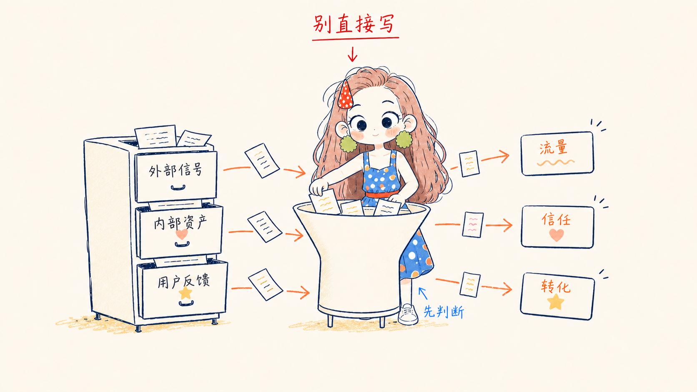
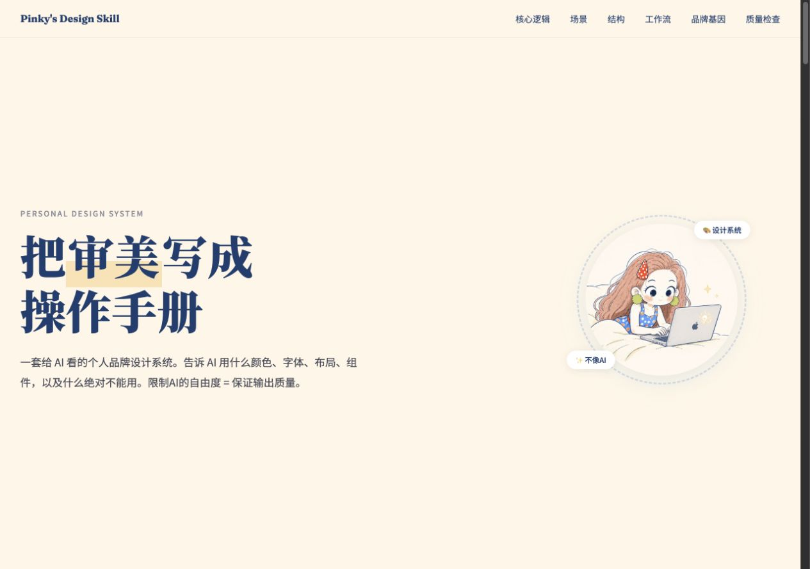
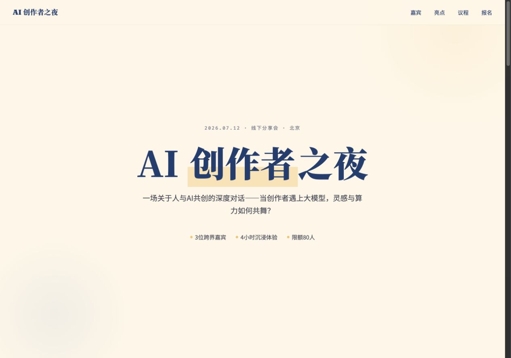
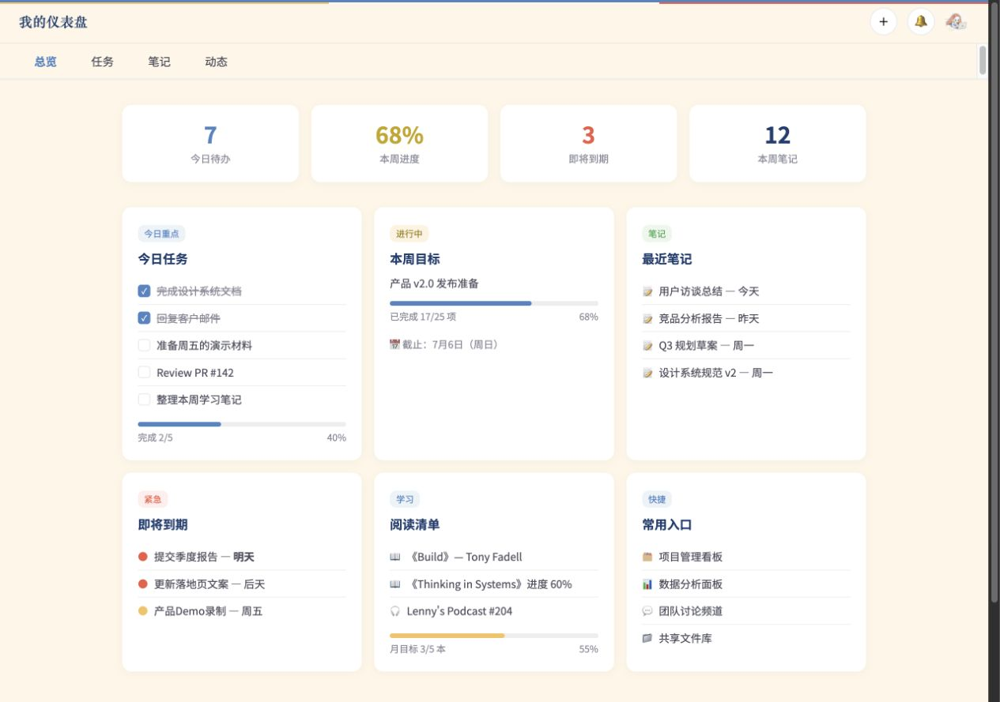
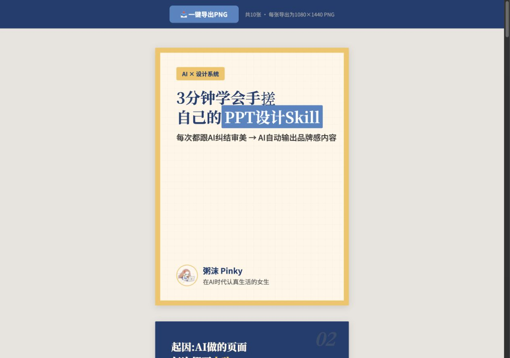
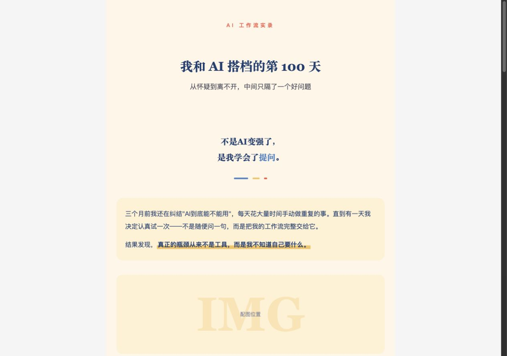
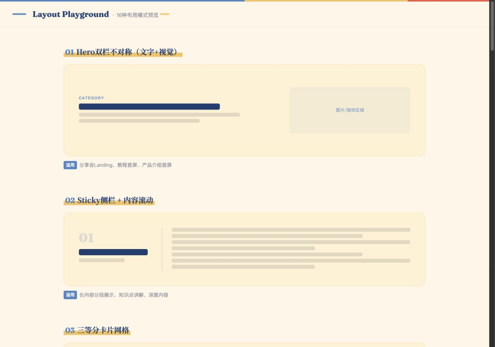
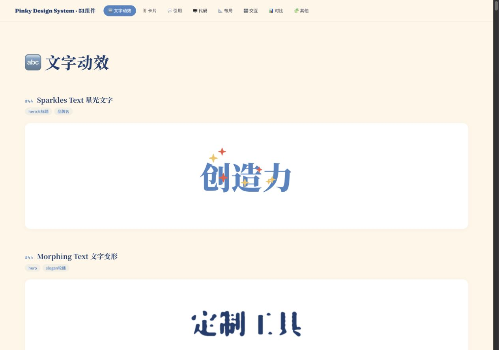

# 粥沫 Pinky Design System

粥沫 Pinky 的个人视觉设计系统，让 PPT、图文卡片、公众号和 HTML 页面使用一致的配色、人物与排版语言。

本仓库基于 [ESTHER不二的 esther-design-system](https://github.com/esthersjw/esther-design-system) 适配：保留布局、组件和模板方法，将品牌视觉配置替换为粥沫 Pinky。原作者署名表示方法论来源，不表示授权、合作或背书。

## 保留原版设计，替换为粥沫身份

所有 Demo 沿用原版字体、字号、排版、布局、层级和交互，仅替换头像、署名及品牌颜色。字体继续使用原版的汇文明朝体 / Noto Serif SC、Fraunces、Caveat、Noto Sans SC 与 Fira Code。

## 视觉风格

**奶油白留白 + 午夜蓝文字与细线 + 粉棕人物识别 + 少量珊瑚红和蜜糖黄强调。**

整体温暖、亲和、略带俏皮；插图使用细手绘线和轻薄彩铅 / 蜡笔颗粒。PPT、图文和公众号默认浅色版面，不以大面积深色底或高饱和渐变制造视觉冲击。

### 固定色板

| 颜色 | 色值 | 用途 |
|---|---|---|
| 奶油白 | `#FFF7E8` | 主背景与留白 |
| 午夜蓝 | `#183A70` | 标题、正文、线稿、边框和信息结构 |
| 粉棕 | `#D99684` | Pinky 长卷发与人物识别 |
| 天空蓝 | `#4E86C5` | 界面主色标记、超链接与 Pinky 波点裙 |
| 珊瑚红 | `#F15A43` | 关键提示、箭头、重点词、发夹和腰带 |
| 蜜糖黄 | `#F6C55F` | 少量高亮、星星与提亮 |
| 嫩黄绿 | `#AABF58` | 仅用于 Pinky 花朵耳环 |

奶油白占主导，午夜蓝负责信息结构，暖色小面积强调；**不沿用原版固定 60% / 30% / 10% 比例**。长正文优先使用午夜蓝，避免浅色文字降低可读性。完整规则见 [brand-dna.md](brand-dna.md)。

### Pinky 人物

固定识别点：白脸大圆头、深蓝圆眼、粉棕长卷发、左上红白波点发夹、绿色花朵耳环、蓝色橙白波点裙、珊瑚红腰带、白鞋和短小身体比例。

Pinky 在解释图和流程图里参与思考、整理、讲解或行动，不只是角落装饰。不同动作保持同一角色的外形与比例。



这张图是**人物身份参考**，含完整场景与文字，不是独立头像或透明人物贴图。默认头像已配置为粥沫提供的 `assets/pinky-avatar.png`，不使用原作者头像或人物替代。

- [人物外形与动作规范](references/zhoumo-pink-ip.md)
- [插图风格、留白与色板规范](references/zhoumo-pink-style.md)

## 适用场景

| 场景 | 使用方式 |
|---|---|
| PPT | 本系统负责配色、人物和视觉一致性；结合演示文稿工具制作，不提供现成 PPTX 模板 |
| 小红书图文 | 3:4 卡片，使用图文模板和对应场景规范 |
| 公众号 | 使用内联样式模板与公众号场景规范 |
| 教程 / 介绍页面 | 使用教程模板组织信息、步骤与插图 |
| 活动页 / Landing | 使用活动页模板，配色服从 Pinky 品牌规范 |
| App / 功能页面 | 使用功能页模板；必要的代码面板可局部使用深色 |

## 文件结构

```text
zhoumo-design-system/
├── SKILL.md                         技能入口与工作流
├── brand-dna.md                     粥沫品牌规范（视觉规则优先级最高）
├── assets/
│   ├── pinky-character-canonical.png  人物标准参考图
│   ├── pinky-avatar.png              用户指定的默认头像
│   ├── template-tutorial.html         教程页模板
│   ├── template-landing.html          活动页模板
│   ├── template-app.html              功能页模板
│   ├── template-cards.html            图文卡片模板
│   ├── template-wechat.html           公众号模板
│   └── html2canvas.min.js             图文导出依赖
└── references/
    ├── zhoumo-pink-ip.md              人物身份与动作规范
    ├── zhoumo-pink-style.md           手绘插图视觉规范
    ├── layouts.md                    布局模式与代码
    ├── components.md                 组件示例与代码
    ├── checklist.md                  质量检查清单
    ├── scene-tutorial.md              教程场景规范
    ├── scene-landing.md               活动页场景规范
    ├── scene-app.md                   功能页场景规范
    ├── scene-cards.md                 图文卡片场景规范
    └── scene-wechat.md                公众号排版规范
```

组件和场景文档保留部分通用示例，选用时将示例中的其他配色映射到 `brand-dna.md`，不能直接套用其他品牌视觉。

## 怎么用

将 [本仓库](https://github.com/vivilin826/zhoumo-design-system) 作为技能安装，或让 AI 读取 `SKILL.md` 和相关规范：

> 按粥沫 Pinky 设计系统制作。使用奶油白底、午夜蓝文字和细线、少量珊瑚红 / 蜜糖黄强调；人物按 Pinky 标准图和人物规范保持一致。

工作流程：

1. 确定类型、受众、内容量、素材和必要约束；已确认的品牌色和人物身份无需反复询问。
2. 读取 `brand-dna.md`，再读取对应场景规范；涉及人物时同时读取 Pinky 人物和插图规范。
3. HTML / 图文 / 公众号从对应模板开始；PPT 将视觉规范应用到演示文稿制作流程。
4. 根据内容选择不同布局与组件，保证信息层次和阅读节奏。
5. 将所选组件的颜色、署名和图片适配为粥沫配置；头像使用 `assets/pinky-avatar.png`。
6. 检查人物一致性、文字可读性、留白、配色与输出尺寸，再交付。

品牌署名默认为 **粥沫**。生成角色插图时，可结合 `zhoumo-pink-ip-illustrations` 技能的样图与验收流程。

### 字体

| 用途 | 字体 |
|---|---|
| 中文标题 | 汇文明朝体 / Noto Serif SC |
| 中文正文 | Noto Sans SC |
| 英文装饰 | Fraunces italic |
| 手写 / 注释 | Caveat |
| 代码 / 终端 | Fira Code |

标题衬线与正文无衬线可以混搭，实际输出需检查字体是否可用、中文是否正确显示。

## Demo 在线预览

以下 7 个 Demo 已适配为粥沫 Pinky 版本。示例文案和数据仅用于展示排版，不代表粥沫真实的发布记录、成果或活动。

[打开全部 Demo](https://vivilin826.github.io/zhoumo-design-system/)

### 教程型 · Design Skill 拆解

保留「把审美写成操作手册」的原版结构，换上粥沫头像与三色。

[在线预览](https://vivilin826.github.io/zhoumo-design-system/demo-readme-tutorial.html) · [HTML 源文件](demo-readme-tutorial.html)

[](https://vivilin826.github.io/zhoumo-design-system/demo-readme-tutorial.html)

### 活动页 / Landing

活动介绍、嘉宾、亮点、议程与 CTA；活动信息为演示文案。

[在线预览](https://vivilin826.github.io/zhoumo-design-system/demo-landing.html) · [HTML 源文件](demo-landing.html)

[](https://vivilin826.github.io/zhoumo-design-system/demo-landing.html)

### 功能页 / App

总览、任务、笔记、动态与新建任务弹窗。

[在线预览](https://vivilin826.github.io/zhoumo-design-system/demo-app.html) · [HTML 源文件](demo-app.html)

[](https://vivilin826.github.io/zhoumo-design-system/demo-app.html)

### 小红书图文卡片

原版卡片排版、页码与导出交互，使用粥沫头像与署名。

[在线预览](https://vivilin826.github.io/zhoumo-design-system/demo-cards.html) · [HTML 源文件](demo-cards.html)

[](https://vivilin826.github.io/zhoumo-design-system/demo-cards.html)

### 公众号排版

原版杂志编号风与内联样式，使用粥沫色板与头像。

[在线预览](https://vivilin826.github.io/zhoumo-design-system/assets/demo-wechat.html) · [HTML 源文件](assets/demo-wechat.html)

[](https://vivilin826.github.io/zhoumo-design-system/assets/demo-wechat.html)

### 布局 Playground

保留原版布局模式，用统一的品牌三色预览。

[在线预览](https://vivilin826.github.io/zhoumo-design-system/demo-layouts.html) · [HTML 源文件](demo-layouts.html)

[](https://vivilin826.github.io/zhoumo-design-system/demo-layouts.html)

### 组件库

保留组件与交互，头像和图片示例替换为 Pinky 素材。

[在线预览](https://vivilin826.github.io/zhoumo-design-system/components-preview.html) · [HTML 源文件](components-preview.html)

[](https://vivilin826.github.io/zhoumo-design-system/components-preview.html)

五套模板与 Demo 使用一致的核心配色。原作者方法论与协议署名保留；人物标准参考图用于角色身份确认，默认头像使用用户提供的 `assets/pinky-avatar.png`。

## 来源与协议

- 原设计系统作者：**ESTHER不二（esthersjw）**，来源为 [esther-design-system](https://github.com/esthersjw/esther-design-system)。
- 本仓库的品牌视觉适配：**粥沫 Pinky**。
- 原项目注明方法论灵感来自 [归藏](https://github.com/guizang) 的 PPT Skill，原项目制作工具为 [Cola](https://colaos.ai)。

沿用的方法论、设计规范、布局、组件、模板及其修改遵循 [CC BY-NC-SA 4.0](https://creativecommons.org/licenses/by-nc-sa/4.0/) 和仓库 [LICENSE](LICENSE)：保留来源署名，禁止商用，修改后以相同协议分享。

原作者的姓名、头像、IP、Logo 和品牌标识不属于该协议的身份使用授权范围，不得用于暗示其运营、授权、合作或背书。Pinky 人物参考用于说明本仓库的视觉配置；本说明不额外授予角色或个人品牌的使用权。
